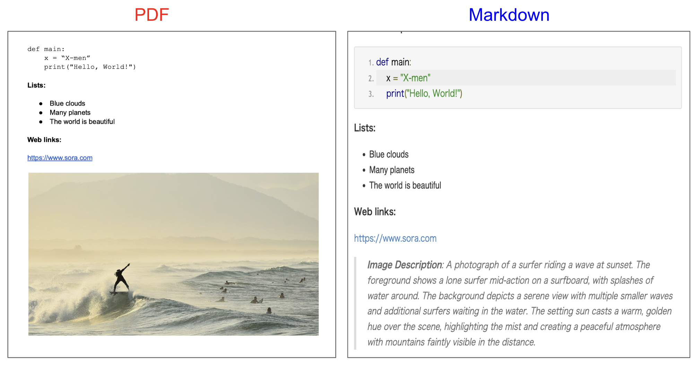
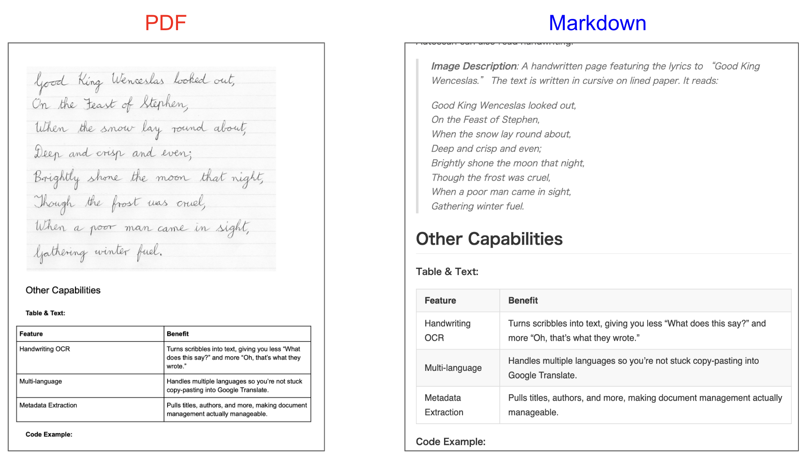

# AutoScan

An LLM-powered library/tool to convert PDF files into Markdown using LLMs (GPT-4o, Gemini, etc.) with high fidelity. It's designed for complex documents like medical records, invoices, and technical papers where accuracy is critical. 

## How It Works

1. **Convert PDF to Images**: Each page of the PDF is converted into an image.
2. **Process Images with LLM**: The images are processed by the LLM to generate Markdown.
3. **Aggregate Markdown**: All Markdown output is combined into one file using a simple algorithm.

## Features

- Converts PDFs to high-fidelity Markdown (preserves tables, layout, formatting)
- Supports images and handwriting OCR
- Works with multiple LLMs via [LiteLLM](https://github.com/BerriAI/litellm)
- Handles multiple languages
- Custom output instructions
- Adjustable accuracy/speed
- Optional output polishing for professional formatting




## Quick Start

### Prerequisites

- **Python 3.12+** required
- **Poppler** (for PDF processing):
  - **macOS**: `brew install poppler`  
  - **Linux**: `sudo apt-get install poppler-utils`  
  - **Windows**: `choco install poppler` or `scoop install poppler`

### Installation

#### Option 1: Install from PyPI (Recommended)

```bash
pip install autoscan
```

#### Option 2: Install from Source

```bash
git clone https://github.com/umermansoor/autoscan.git
cd autoscan
poetry install
poetry shell  # Activates the virtual environment
```

### API Keys

Set your API key based on the model you plan to use:

```bash
# For OpenAI (gpt-4o)
export OPENAI_API_KEY="your_key"
# For Gemini (recommended for lower cost)
export GEMINI_API_KEY="your_key"
# For Anthropic
export ANTHROPIC_API_KEY="your_key"
```

**Get Gemini API Key**: Visit [Google AI Studio](https://aistudio.google.com/app/apikey) - free!

## Usage

### Command Line

```bash
# Test with OpenAI GPT-4o (default)
autoscan examples/helloworld.pdf

# Test with Gemini (cost-effective option)
autoscan --model gemini/gemini-2.0-flash examples/table.pdf

# Add extra LLM prompt
autoscan --prompt "Skip disclaimers" yourfile.pdf

# Polish output formatting
autoscan --polish-output yourfile.pdf

# Process only specific pages
autoscan --first-page 5 --last-page 10 yourfile.pdf
```

Markdown files are saved in the `output/` directory.

### API Example

```python
import asyncio
from autoscan.autoscan import autoscan

async def main():
    result = await autoscan("yourfile.pdf", model_name="gemini/gemini-2.0-flash", accuracy="high")
    print(result.markdown)

asyncio.run(main())
```


## Model Comparison

| Model             | Speed      | Cost      | Best For                     |
|-------------------|------------|-----------|------------------------------|
| Gemini 2.0 Flash  | Fastest    | Cheapest  | General, image-rich docs     |
| GPT-4o            | Slower     | Higher    | Table-heavy, complex layouts |

- Use **Gemini** for most documents (fast & low cost).
- Use **GPT-4o** for best table formatting.


## Configuration

### View All CLI Options

To see all available command line options:

```bash
autoscan --help
```

### API Function Signature

```python
async def autoscan(
    pdf_path: str,                          # Required: Path to PDF file
    model_name: str = "openai/gpt-4o",      # AI model (openai/gpt-4o, gemini/gemini-2.0-flash, etc.)
    accuracy: str = "high",                 # Processing mode: "low" (fast) or "high" (accurate)
    user_instructions: str = None,          # Custom instructions for the LLM
    output_dir: str = None,                 # Output directory (defaults to ./output/)
    temp_dir: str = None,                   # Temp directory for images (auto-created if None)
    concurrency: int = 10,                  # Max concurrent API calls (low accuracy only)
    save_llm_calls: bool = False,           # Save prompts/responses for debugging
    polish_output: bool = False,            # Apply additional formatting pass
    first_page: int = None,                 # First page to process (defaults to beginning)
    last_page: int = None,                  # Last page to process (defaults to end)
) -> AutoScanOutput
```

**Output**: By default, output (Markdown) files are saved to `output/` directory, optional logs in `logs/` directory.

### Accuracy Levels

AutoScan uses different processing strategies and image quality settings for each accuracy level:

- **`low`**: Pages processed concurrently (faster). Pages are processed independently without previous page context for maximum speed and lower costs. Uses **150 DPI** for smaller file sizes and faster processing.
- **`high`**: Pages processed sequentially (slower but more accurate). The entire previous page markdown is sent as context, which increases token usage (cost) and runtime but provides better formatting consistency. Uses **200 DPI** for higher image quality and better text recognition.

**DPI (Dots Per Inch) Impact:**
- **Higher DPI** = Better text clarity and OCR accuracy, but larger files and higher costs
- **Lower DPI** = Faster processing and lower costs, but slightly reduced quality for fine details
- DPI automatically adjusts based on accuracy level - no manual configuration needed

## Testing

To run the test suite:

```bash
pytest tests/
```

### Integration Testing

For comprehensive integration testing with real PDF files:

```bash
# Set your Gemini API key (required)
export GEMINI_API_KEY="your_gemini_api_key_here"

# Run integration tests on example PDFs
python tests/integration/test_examples_integration.py
```

**What it does:**
- Processes all PDF files in the `examples/` directory
- Alternates between low and high accuracy modes for comparison  
- Applies safety limits (max 5 files, max 15 pages/file) to control costs
- Reports comprehensive statistics: processing time, cost, tokens, success rate

## Troubleshooting

### Common Issues

**ImportError or Module Not Found**
- Ensure you've **activated your virtual environment**: `poetry shell`
- Verify installation: `poetry install`

**PDF Processing Errors**
- Make sure Poppler is correctly installed and accessible in your PATH
- Test with: `pdftoppm -h` (should show help if Poppler is installed)

**Python Version Issues**
- Requires Python 3.12+. Check with: `python --version`
- If using older Python, consider upgrading or using pyenv

**High Costs**
- Use Gemini models (significantly cheaper for similar documents)
- Use `--accuracy low` to reduce token usage
- Test with smaller documents first

**Slow Processing**
- Use `--accuracy low` or `medium` for concurrent processing
- Consider Gemini 2.0 Flash for faster speeds
- Check your internet connection for API calls

## Contributing

1. Fork the repository
2. Create a feature branch: `git checkout -b feature-name`
3. Make your changes and add tests
4. Run the test suite: `pytest tests/`
5. Submit a pull request

## License

This project is licensed under the MIT License. Use at your own risk.

THE SOFTWARE IS PROVIDED "AS IS", WITHOUT WARRANTY OF ANY KIND, EXPRESS OR IMPLIED, INCLUDING BUT NOT LIMITED TO THE WARRANTIES OF MERCHANTABILITY, FITNESS FOR A PARTICULAR PURPOSE AND NONINFRINGEMENT. IN NO EVENT SHALL THE AUTHORS OR COPYRIGHT HOLDERS BE LIABLE FOR ANY CLAIM, DAMAGES OR OTHER LIABILITY, WHETHER IN AN ACTION OF CONTRACT, TORT OR OTHERWISE, ARISING FROM, OUT OF OR IN CONNECTION WITH THE SOFTWARE OR THE USE OR OTHER DEALINGS IN THE SOFTWARE.